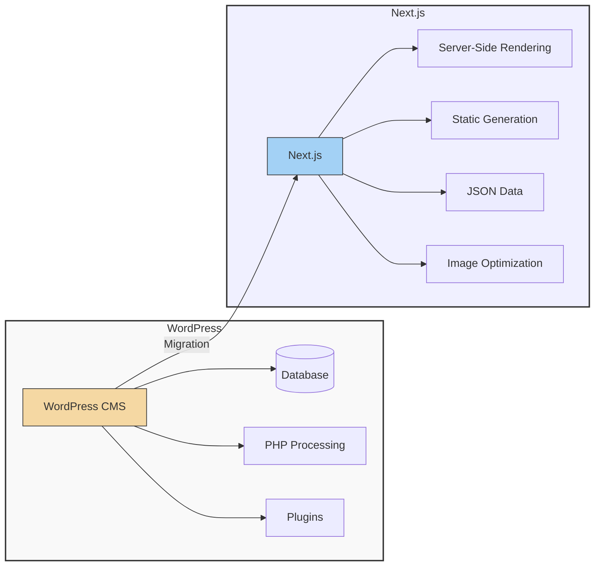
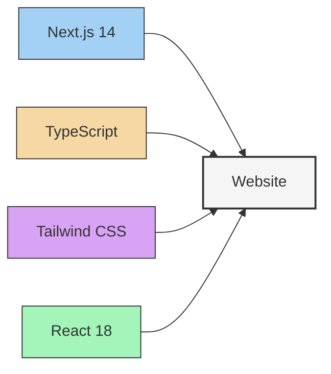
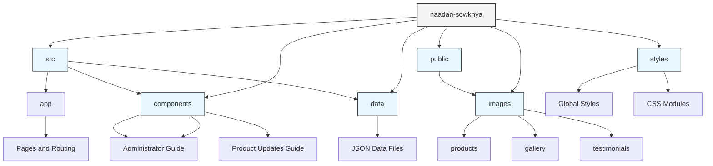

# Naadan Sowkhya - Next.js Website

## High-Level Overview
This project is a modern Next.js implementation of the Naadan Sowkhya e-commerce website, migrated from WordPress. The core goal of this migration is to deliver enhanced performance, an improved user experience (UX), and better maintainability.

## Key Features & Improvements



-   **🚀 Performance Enhancements:**
    -   Fast page loads with Next.js 14 (static generation & server-side rendering).
    -   Optimized image loading with `next/image`.
    -   Reduced time-to-interactive with client-side routing.
    -   Improved Core Web Vitals scores.
-   **💅 UI/UX Improvements:**
    -   Completely redesigned responsive interface.
    -   Enhanced product browsing with categorized views.
    -   Image lightbox for better product visualization.
    -   Smooth animations and transitions.
    -   Improved mobile navigation experience.
-   **🛠️ Technical Improvements:**
    -   Typescript implementation for better code reliability.
    -   Modular component architecture.
    -   Structured data management with JSON (no database queries).
    -   Improved SEO with Next.js metadata.
    -   Zero plugin dependencies and full control over codebase.
-   **📱 Mobile Experience:**
    -   Mobile-first responsive design.
    -   Touch-friendly navigation.
    -   Optimized images and load times for mobile devices.

## Tech Stack



-   Next.js 14
-   TypeScript
-   Tailwind CSS
-   React 18

## Live Demo / Website Link
`[View Live Website](https://www.naadansowkhya.com) (Note: Please verify this is the correct link to the live site and update if necessary.)`

## Getting Started (For Developers)

### Prerequisites
-   Node.js (LTS version recommended)
-   Git

### Installation
1.  Clone the repository:
    ```bash
    git clone https://github.com/umshere/naadan-sowkhya.git
    cd naadan-sowkhya
    ```
2.  Install dependencies:
    ```bash
    npm install
    ```

### Running Locally
1.  Start the development server:
    ```bash
    npm run dev
    ```
2.  Open your browser and navigate to `http://localhost:3000`.

## Content Management (For Administrators/Content Editors)
Content for the website (products, gallery, testimonials) is managed through JSON files located in the `src/data/` directory.

For detailed instructions on setting up the local environment for content editing and making updates, please see the [Administrator's Guide](docs/admin-guide.md).

The primary files for content updates are:
-   `src/data/products.json` (for products)
-   `src/data/gallery.json` (for the image gallery)
-   `src/data/testimonial-images.json` (for testimonials)

Image assets are stored in `public/images/` within respective subfolders (e.g., `public/images/products/`).

## Product Updates System
Product information is managed via `src/data/products.json`. The project includes an automated validation system to ensure data integrity.

For detailed instructions on updating product information, validation, and best practices, please refer to the [Product Updates Guide](docs/product-updates.md).

An automated GitHub Actions workflow validates changes to product data, creates a pull request, and assigns reviewers, ensuring all updates are reviewed before going live. To run validation locally:
```bash
npm run validate:products
```

## Project Structure

-   `/src/app/*` - Next.js pages and routing
-   `/src/components/*` - Reusable React components
-   `/src/data/*` - JSON data files for content
-   `/public/images/*` - Optimized image assets (products, gallery, testimonials)
-   `/styles/*` - Global styles and CSS modules
-   `/docs/*` - Project documentation (including Administrator and Product Update guides)
-   `/scripts/*` - Utility scripts (e.g., validation)
-   `/.github/workflows/*` - GitHub Actions workflows (e.g., product validation)
