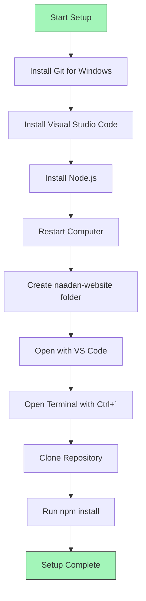
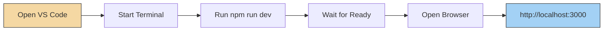

# Administrator's Guide for Content Management

This section contains detailed setup instructions for non-technical administrators to run the website locally for content updates.

### First-Time Setup (One-Time Process) for Administrators



1. Install Required Software (Windows):

   - Download and install Git for Windows: https://git-scm.com/download/win
     - During installation, click "Next" for all options (use default settings).
   - Download and install Visual Studio Code: https://code.visualstudio.com/
     - During installation, make sure "Add to PATH" is checked.
   - Download and install Node.js: https://nodejs.org/ (Click on "LTS" version).
     - During installation, check "Automatically install necessary tools."
   - After installation, restart your computer.

2. Get the Website Files (Windows):
   - Create a new folder on your desktop named "naadan-website".
   - Right-click on the folder and select "Open with Code".
   - In Visual Studio Code, press Ctrl+` (the key above Tab) to open the terminal.
   - If you see "Select Default Profile", choose "Git Bash".
   - Copy and paste these commands one by one into the terminal and press Enter after each:
     ```bash
     git clone https://github.com/umshere/naadan-sowkhya.git .
     ```
     ```bash
     npm install
     ```
   - Wait for installation to complete (this may take a few minutes).

### Running the Website Locally (Windows) for Administrators



1. Opening the Website:
   - Navigate to your "naadan-website" folder.
   - Right-click inside the folder and select "Open with Code".
   - If you don't see "Open with Code", you might need to reinstall Visual Studio Code (ensure "Add to PATH" is checked during installation) and restart your computer.

2. Starting the Website:
   - In Visual Studio Code, press Ctrl+` (the key above Tab) to open the terminal.
   - If the terminal shows "PowerShell", click the dropdown (▼) next to the + icon and select "Git Bash".
   - Type this command and press Enter:
     ```bash
     npm run dev
     ```
   - Wait until you see "Ready" in green text in the terminal.
   - Open your web browser (like Chrome or Firefox) and go to: `http://localhost:3000`

3. Stopping the Website:
   - Go back to Visual Studio Code.
   - Click inside the terminal.
   - Press Ctrl+C.
   - If asked to terminate the batch job, type 'y' and press Enter.

### Making Content Updates (Windows) for Administrators

```mermaid
flowchart TD
    A[Open VS Code] --> B[Find Content Files in src/data]
    B --> C{Choose File to Edit}
    C -->|Products| D[Edit products.json]
    C -->|Gallery| E[Edit gallery.json]
    C -->|Testimonials| F[Edit testimonial-images.json]
    
    G[Adding Images] --> H[Open public/images folder]
    H --> I{Choose Subfolder}
    I -->|Product Images| J[Add to products folder]
    I -->|Gallery Images| K[Add to gallery folder]
    I -->|Testimonial Images| L[Add to testimonials folder]
    
    D --> M[Save Changes: Ctrl+S]
    E --> M
    F --> M
    J --> M
    K --> M
    L --> M
    M --> N[View Changes on localhost:3000 (Refresh Browser)]
    
    style A fill:#f5d8a3,stroke:#333,stroke-width:1px
    style N fill:#a3d1f5,stroke:#333,stroke-width:1px
```

1. Finding Content Files:
   - In Visual Studio Code, look at the left sidebar (this is the "Explorer").
   - If you don't see it, click on the top icon (looks like two files).
   - Open the "src" folder, then the "data" folder.
   - Choose the file to edit:
     - `products.json` - For product listings.
     - `gallery.json` - For the image gallery.
     - `testimonial-images.json` - For customer testimonials.

2. Adding New Images:
   - Open Windows Explorer (File Explorer) and navigate to your "naadan-website" folder.
   - Go into the "public" folder, then the "images" folder.
   - Choose the correct subfolder for your image type:
     - "products" - For product images.
     - "gallery" - For gallery images.
     - "testimonials" - For testimonial images.
   - Copy your new images into the chosen folder.
   - **Important:** Use simple filenames without spaces or special characters (e.g., `black-seed-oil.jpg`, `new-event-image.png`). Note the exact filename including `.jpg`, `.png`, etc.

3. Editing JSON Files and Saving Changes:
   - Click on the JSON file in Visual Studio Code to open it.
   - Carefully make your text changes. Pay attention to quotes (`"`), commas (`,`), and brackets (`[]`, `{}`).
   - After editing, press Ctrl+S to save the file.
   - Check your changes by refreshing the website in your browser (`http://localhost:3000`).
   - If the page shows errors or doesn't load:
     - Double-check the JSON file for syntax errors (e.g., missing commas, mismatched quotes or brackets).
     - Ensure image filenames in the JSON file exactly match the actual filenames in the `public/images/...` folders (case-sensitive).
     - Try stopping (Ctrl+C in terminal) and restarting the website (`npm run dev`).

### Common Issues & Solutions (Windows) for Administrators

1.  "Command not found" Error (e.g., `git: command not found`, `npm: command not found`):
    *   This usually means the software (Git or Node.js) was not installed correctly or "Add to PATH" was not selected.
    *   Close Visual Studio Code.
    *   Reinstall Git for Windows and/or Node.js, ensuring "Add to PATH" (or similar option) is checked during installation.
    *   Restart your computer.
    *   Try opening the folder in VS Code and running commands again.

2.  Terminal Shows PowerShell Instead of Git Bash:
    *   In the terminal panel in VS Code, click the dropdown menu (it might show "powershell" or "pwsh") next to the "+" icon.
    *   Select "Git Bash" from the list.
    *   If Git Bash is not listed, Git for Windows might not be installed correctly. Reinstall it.

3.  Changes Not Showing Up on the Website:
    *   Ensure you have saved the file(s) you edited in Visual Studio Code (Ctrl+S).
    *   Refresh your browser page (Ctrl+R or F5).
    *   If still not working, stop the local development server (Ctrl+C in the VS Code terminal) and restart it (`npm run dev`).

4.  Images Not Loading on the Website:
    *   Check image filenames in your JSON data files. They must exactly match the actual filenames in the `public/images/...` folders (this includes capitalization and file extension like `.jpg` or `.png`).
    *   Make sure images are in the correct subfolders within `public/images/` (e.g., product images in `public/images/products/`).
    *   Verify that image formats are web-compatible (usually `.jpg`, `.jpeg`, `.png`, `.webp`).

### When to Ask for Help
Contact the development team when:
- You encounter error messages you don't understand after trying the troubleshooting steps.
- The website won't start locally after following all setup and troubleshooting steps.
- You need to make changes to the website's design, layout, or colors.
- You need to add new features, sections, or pages to the website.
- Your content changes are not appearing online after your pull request (if applicable) has been merged.
