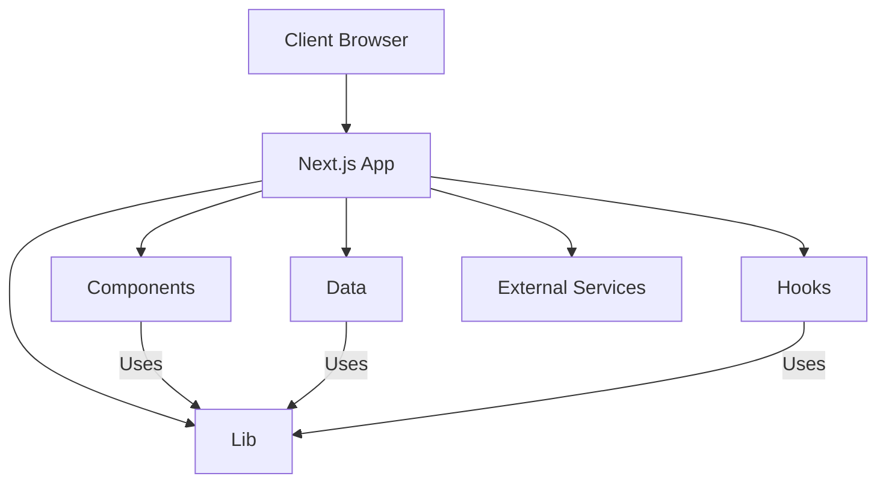

# Project Architecture Documentation

## High-Level Architecture Diagram (ASCII)

```
+----------------------+
|    Client Browser    |
+----------+-----------+
           |
           v
+----------------------+
|     Next.js App      |
| (src/app, Routing)   |
+----------+-----------+
           |
    +------+------+---------------------+
    |             |            |        |
    v             v            v        v
[Components]  [Data]      [Hooks]   [Lib/Utils]
(src/components) (src/data) (src/hooks) (src/lib)
    |             |            |        |
    +------+------+------------+--------+
           |
           v
+----------------------+
|   External Services  |
| (APIs, DB, etc.)     |
+----------------------+
```

---

## Mermaid Diagram (for Visual Tools)

You can copy this into a Markdown file or a tool that supports Mermaid.js for a visual representation:



---

## Architecture Overview

This project is a modern web application built with **Next.js** and **TypeScript**, styled using **Tailwind CSS**. The architecture follows a modular pattern, separating concerns into components, data modules, hooks, and utilities.

### Main Components

- **App Directory (`src/app`)**: Handles application routing, layouts, and page-level logic using Next.js’ app directory structure.
- **Components (`src/components`)**: Contains reusable React components for UI.
- **Data (`src/data`)**: Stores data modules, static content, or data-fetching logic.
- **Hooks (`src/hooks`)**: Custom React hooks for encapsulating stateful logic and side effects.
- **Lib (`src/lib`)**: Utility functions and helper modules.
- **Styles (`src/styles`)**: Tailwind CSS configuration and custom styles.
- **Types (`src/types`)**: TypeScript type definitions for strong typing across the codebase.

### Data Flow

1. Users interact with the UI (components) rendered by the Next.js app.
2. Components may use hooks for state management or side effects.
3. Data is fetched from `src/data`, external APIs, or other services.
4. Utilities in `src/lib` support business logic and data transformation.
5. All code is strongly typed using TypeScript definitions from `src/types`.

### How to Visualize

- You can convert the above ASCII diagram into a visual diagram using tools like [draw.io](https://draw.io), [Excalidraw](https://excalidraw.com/), or [Lucidchart](https://lucidchart.com/).
- For automated diagrams, use the Mermaid.js code above in your Markdown files or documentation tools that support Mermaid.

---

## Pages and Routing Structure

This project’s pages are organized as follows (Next.js app directory structure):

- `/` (Home): Main landing page, composed of multiple sections (Hero, Products, About, Reviews, Gallery, Certifications, etc.), each implemented as a separate component.
- `/about-us`: About Us page.
  - `/about-us/about-ceo`: Subpage about the CEO.
- `/contact`: Contact information and form.
- `/gallery`: Image or media gallery.
- `/our_products/[product]`: Dynamic route for individual product details.
- `/product_category/[category]`: Dynamic route for product categories.
- `/products`: Overview of all products.
  - `/products/[slug]`: Dynamic product detail page.
- `/testimonials`: Customer testimonials.

## Component and Styling Patterns

- **Component Diversity**: Pages use a mix of custom-built components and third-party UI libraries.
- **Styling Diversity**: Both Tailwind CSS and shadcn/ui components are used. This results in a non-standardized component style across pages.
- **Dynamic Imports**: Some components are loaded dynamically for client-side features, improving performance but adding complexity.
- **Layout Variations**: Some pages have custom layouts, while others rely on the global app layout.

## Design Principles & Branding

### Mobile-First Approach

- The application is designed with mobile users as the primary audience.
- All pages and components must be fully responsive, ensuring seamless usability and aesthetics on mobile devices first, then scaling up to tablets and desktops.

### Brand Consistency

- The website should embody a cohesive brand identity, with unified color schemes, typography, spacing, and UI patterns.
- All pages and components should follow the same style guide to reinforce the brand and improve user trust.

### Style Standardization

- Migrate toward a single styling methodology (e.g., Tailwind CSS or a custom design system) to eliminate inconsistencies caused by mixed usage of Tailwind, shadcn/ui, and custom styles.
- Audit existing components and refactor as needed to ensure all UI elements adhere to the chosen style guide.

### Actionable Recommendations

- Create or update a central style guide and component library.
- Refactor existing pages/components to use only the standardized design system.
- Regularly review new code to ensure adherence to mobile-first and brand guidelines.

## Design Consistency Note

Due to multiple refactors and the use of different component libraries and styling approaches, the codebase currently exhibits a lack of unified design patterns. Pages may look and behave differently depending on which components and styles were used during their development.

---

## Home Page Revamp Plan

The home page is being revamped to align with the new style guide, ensure mobile-first responsiveness, and create a cohesive brand experience. The plan includes:

1. **Unify Layout Logic**

   - Use responsive Tailwind CSS classes to manage layout for mobile and desktop, reducing code duplication.

2. **Component Audit & Update**

   - Ensure all home page sections and components (Hero, Guarantee, About, Categories, Products, Testimonials, Gallery, Certifications) use only Tailwind CSS and follow the style guide for colors, spacing, border radius, and typography.

3. **Modernize Navigation**

   - Refine StickyNav and HomePageTabs for a more cohesive, brand-aligned look and improved mobile usability.

4. **Enhance Mobile Experience**

   - Optimize touch targets, stacking, and spacing for mobile users.

5. **Accessibility**

   - Use semantic HTML, alt text, and ARIA roles where needed.

6. **Testing & Iteration**
   - Test on multiple devices and screen sizes, refining layout and styles as needed.

---

### Home Page: Current Analysis

**Current State:**

- The home page is composed of multiple sections (Hero, Guarantee, About, Categories, Products, Testimonials, Gallery, Certifications), each implemented as a separate component and wrapped with SectionWrapper for consistent spacing and background.
- Uses both mobile tab-based navigation (HomePageTabs) and desktop section stacking, with duplicated logic and some code redundancy.
- Styling is a mix of Tailwind CSS, custom classes, and possibly shadcn/ui or other libraries, leading to inconsistencies.
- Dynamic imports and custom backgrounds add visual interest, but may impact performance and maintainability.

**Branding & UI/UX Gaps:**

- Inconsistent use of color, spacing, and typography across sections.
- Navigation and interaction patterns differ between mobile and desktop.
- Not all components fully leverage the new style guide or brand assets.
- Some sections may lack clear call-to-action or brand storytelling.

**Suggestions:**

- Unify layout and navigation logic using Tailwind’s responsive utilities.
- Refactor all sections to use only Tailwind CSS and follow the style guide for color, spacing, and typography.
- Standardize all CTAs, buttons, and interactive elements for brand consistency.
- Optimize images and backgrounds for performance and mobile experience.
- Ensure every section reinforces the brand story and visual identity.

> For a detailed breakdown and recommendations, see [docs/pages/home.md](pages/home.md).

---

## Per-Page Analysis & Next Steps

For detailed analysis, branding assessment, and actionable recommendations for each main page, see the following documents:

- [Home Page](pages/home.md)
- [About Us Page](pages/about-us.md)
- [Contact Page](pages/contact.md)
- [Gallery Page](pages/gallery.md)
- [Products Page](pages/products.md)

Each page document includes:

- Current structure and components
- Branding and UI/UX assessment (strengths and gaps)
- Suggestions and action items for aligning with the brand and style guide
- Next steps for refactoring and documentation

**Next Steps:**

- Use these per-page documents as a checklist for your revamp and refactor process.
- Update each document as you make changes, noting before/after for major sections.
- Ensure all updates reinforce mobile-first, brand-consistent, and accessible design.

For overall standards, always refer to this architecture document and the [Style Guide](style-guide.md).

---

**Next Steps:**

- Begin refactoring the home page section-by-section, checking in changes incrementally for review and feedback.

---

For further details or customization, update this document as your project evolves.
