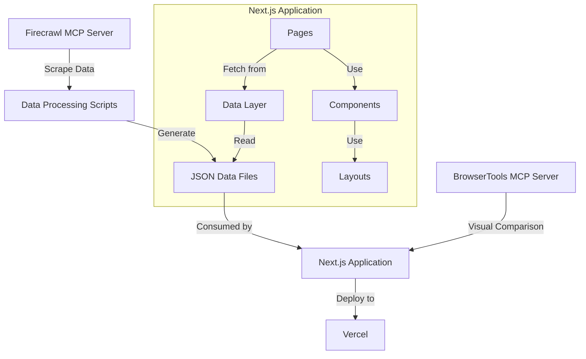

# Detailed Plan: Rebuilding Sowkhya Products Website as a Next.js Application

## Project Overview

We'll create a Next.js application that replicates the https://sowkhyaproducts.com website, maintaining all its functionality including:

- Homepage with slider, about section, product categories, featured products, testimonials, and certifications
- Product category pages with product listings
- Individual product detail pages
- About us/CEO page
- Contact page
- WhatsApp ordering system

## Architecture and Data Flow



## Implementation Plan

### Phase 1: Project Setup and Data Extraction (2-3 days)

1. **Initialize Next.js Project**

   - Set up a new Next.js project with TypeScript
   - Configure TailwindCSS for styling
   - Set up project structure (pages, components, data, public)

2. **Data Extraction and Processing**

   - Use Firecrawl MCP Server to scrape all pages from sowkhyaproducts.com
   - Extract and organize the following data:
     - Product categories
     - Products with details (name, description, price, images)
     - Homepage content (slider images, about text, testimonials)
     - About us/CEO content
     - Contact information
   - Process and structure the data into JSON files
   - Download and organize all images

3. **Asset Collection**
   - Download all images, icons, and other assets
   - Organize assets in the public directory

### Phase 2: Core Components and Layouts (3-4 days)

1. **Create Base Layout Components**

   - Header with navigation
   - Footer with contact information and links
   - Mobile menu
   - WhatsApp/Call/Enquiry floating buttons

2. **Develop Reusable UI Components**

   - Product card component
   - Image slider/carousel
   - Testimonial slider
   - Category card
   - Button components (primary, secondary, WhatsApp order)

3. **Implement Styling**
   - Set up global CSS variables for colors, fonts, etc.
   - Implement responsive design using TailwindCSS
   - Ensure styling matches the original site

### Phase 3: Page Implementation (4-5 days)

1. **Homepage**

   - Hero slider section
   - About section with company description
   - Product categories section
   - Featured products slider
   - Testimonials section
   - Certifications section

2. **Product Category Pages**

   - Implement dynamic routing for categories
   - Create product listing grid
   - Add filtering functionality if present in original

3. **Product Detail Pages**

   - Implement dynamic routing for products
   - Product image display
   - Product information (name, description, price)
   - WhatsApp order button with pre-filled message
   - Similar products section

4. **About/CEO Page**

   - Mission and vision sections
   - Founder information with image
   - Company history

5. **Contact Page**
   - Contact information display
   - Google Maps integration (if present in original)
   - Contact form (if functional in original)

### Phase 4: Functionality and Integration (2-3 days)

1. **WhatsApp Ordering System**

   - Implement "Order Now" buttons that link to WhatsApp with pre-filled product information
   - Ensure proper URL encoding for special characters

2. **Navigation and Routing**

   - Implement navigation between pages
   - Set up proper routing for all pages
   - Add breadcrumbs for product pages

3. **Responsive Design Refinement**
   - Ensure the site works well on all device sizes
   - Test and refine mobile menu functionality
   - Optimize images for different screen sizes

### Phase 5: Testing and Deployment (2-3 days)

1. **Cross-browser Testing**

   - Test the application across different browsers
   - Use BrowserTools MCP Server for visual comparison with original site
   - Fix any styling or functionality issues

2. **Performance Optimization**

   - Optimize image loading with Next.js Image component
   - Implement lazy loading for off-screen content
   - Optimize font loading

3. **Deployment to Vercel**

   - Set up Vercel project
   - Configure build settings
   - Deploy the application
   - Set up custom domain if required

4. **Final Review and Adjustments**
   - Compare with original site using BrowserTools MCP Server
   - Make final adjustments to ensure exact replication
   - Test all functionality

## Project Structure

```
sowkhya-next/
├── public/
│   ├── images/
│   │   ├── products/
│   │   ├── slider/
│   │   ├── certifications/
│   │   └── about/
│   └── icons/
├── src/
│   ├── app/
│   │   ├── page.tsx (Homepage)
│   │   ├── layout.tsx (Root layout)
│   │   ├── globals.css
│   │   ├── product_category/[category]/page.tsx
│   │   ├── our_products/[product]/page.tsx
│   │   ├── about-us/page.tsx
│   │   ├── about-us/about-ceo/page.tsx
│   │   └── contact/page.tsx
│   ├── components/
│   │   ├── layout/
│   │   │   ├── Header.tsx
│   │   │   ├── Footer.tsx
│   │   │   ├── MobileMenu.tsx
│   │   │   └── FloatingButtons.tsx
│   │   ├── ui/
│   │   │   ├── ProductCard.tsx
│   │   │   ├── Slider.tsx
│   │   │   ├── TestimonialCard.tsx
│   │   │   └── Button.tsx
│   │   ├── home/
│   │   │   ├── HeroSlider.tsx
│   │   │   ├── AboutSection.tsx
│   │   │   ├── ProductCategories.tsx
│   │   │   ├── FeaturedProducts.tsx
│   │   │   ├── TestimonialsSection.tsx
│   │   │   └── CertificationsSection.tsx
│   │   └── product/
│   │       ├── ProductGrid.tsx
│   │       ├── ProductDetail.tsx
│   │       └── SimilarProducts.tsx
│   └── data/
│       ├── products.json
│       ├── categories.json
│       ├── testimonials.json
│       ├── homepage.json
│       └── about.json
├── next.config.ts
├── tailwind.config.js
├── package.json
└── tsconfig.json
```

## Technologies and Tools

1. **Core Technologies**

   - Next.js 15.2.3 (App Router)
   - React 19.0.0
   - TypeScript
   - TailwindCSS 4

2. **Data Management**

   - Local JSON files for storing scraped data
   - Next.js API routes for data fetching (if needed)

3. **Image Handling**

   - Next.js Image component for optimized image loading
   - Image processing for responsive sizes

4. **Development and Testing Tools**
   - Firecrawl MCP Server for data extraction
   - BrowserTools MCP Server for visual comparison
   - ESLint for code quality
   - Vercel for deployment

## Timeline

The entire project is estimated to take approximately 2-3 weeks to complete:

- Phase 1 (Project Setup and Data Extraction): 2-3 days
- Phase 2 (Core Components and Layouts): 3-4 days
- Phase 3 (Page Implementation): 4-5 days
- Phase 4 (Functionality and Integration): 2-3 days
- Phase 5 (Testing and Deployment): 2-3 days

## Potential Challenges and Solutions

1. **Challenge**: Ensuring exact visual replication of the original site
   **Solution**: Use BrowserTools MCP Server for side-by-side comparison and make adjustments as needed

2. **Challenge**: Handling all product data efficiently
   **Solution**: Organize data in well-structured JSON files and implement efficient data fetching

3. **Challenge**: Replicating dynamic elements like sliders and carousels
   **Solution**: Use React libraries that provide similar functionality or implement custom components

4. **Challenge**: Ensuring responsive design across all devices
   **Solution**: Use TailwindCSS breakpoints and test thoroughly on various screen sizes

5. **Challenge**: Maintaining performance with many images
   **Solution**: Optimize images, use Next.js Image component, and implement lazy loading
