# Visual Redesign Plan for Naadan Sowkhya

## Core Design Principles

1. **Mobile-First, App-Like Experience**

   - Design with mobile interactions as the primary focus
   - Create smooth, native-feeling transitions and animations
   - Use touch-optimized navigation patterns

2. **Modern, Clean Aesthetic**

   - Simplified layouts with proper whitespace
   - Focused content presentation
   - Strategic use of color to emphasize brand identity

3. **Performance Optimization**
   - Lazy-loading and code-splitting
   - Optimized image delivery
   - Minimal JavaScript footprint

## Components to Enhance

### Navigation

- [x] Create mobile bottom navigation bar that appears/disappears based on scroll direction
- [x] Implement enhanced contact options drawer with Shadcn UI
- [ ] Implement app-like transitions between pages
- [ ] Add pull-to-refresh functionality on product listings
- [ ] Create a mobile-optimized search experience

### Product Presentation

- [x] Build enhanced product detail page with improved image gallery
- [x] Create compact product card for horizontal scrolling sections
- [ ] Implement product quick view modal with gestures
- [ ] Create animated "add to favorites" interaction

### Home Screen

- [x] Redesign hero section with app-like carousel
- [x] Implement category grid with tactile feedback
- [x] Create featured products section with horizontal scrolling
- [x] Add animated testimonial carousel

### UI Elements

- [x] Utilize Shadcn UI components consistently (e.g., `Button`, `Card`, `Drawer` used in `HeroSlider`, `ProductGuarantee`, `AboutSection`, `ContactOptionsDrawer`)
- [x] Create tab-based navigation for mobile home view
- [x] Implement contact options drawer with multiple contact methods
- [ ] Implement haptic-like feedback on interactions
- [x] Create unified contact experience with drawer component

## Recent Improvements

### Animation System Fixes

- [x] Fixed AnimatePresence warnings in multiple components
- [x] Optimized HeroSlider animation for smoother mobile experience
- [x] Improved TabView animations and transitions
- [x] Fixed animation issues in HomePageTabs component
- [x] Optimized AnimationProvider for better nested animations
- [x] Enhanced BottomNavigation animation behavior

### Mobile Hero Section Enhancement

- [x] Reduced hero section height on mobile (from 600px to 400px)
- [x] Optimized animations for better mobile performance
- [x] Added self-hiding swipe indicator for better user guidance
- [x] Improved text sizing and spacing for mobile screens
- [x] Reduced animation delays and durations for faster response

### Mobile Contact Options Enhancement

- [x] Implemented Shadcn UI drawer component for contact options
- [x] Consolidated multiple contact methods (WhatsApp, phone, email, social media) in a single drawer
- [x] Removed redundant floating WhatsApp button for cleaner mobile UI
- [x] Created a responsive design with desktop-only WhatsApp button
- [x] Optimized scroll-to-top button for better mobile UX

### Spacing Consistency

- [x] Standardized section spacing throughout homepage (reduced from variable `space-y-8 md:space-y-16 lg:space-y-24` to consistent `space-y-12 md:space-y-16`)
- [x] Optimized AboutSection padding (from `py-20 lg:py-32` to `py-12 md:py-16 lg:py-20`)
- [x] Adjusted internal component spacing to create visual harmony
- [x] Reduced excessive margins between content blocks

### Navigation Enhancements

- [x] Implemented sticky tab navigation with auto-scrolling
- [x] Added proper ID attributes for section targeting
- [x] Created tab content scrolling with header offset compensation
- [x] Enhanced visual feedback during tab changes

### Visual Flow Improvements

- [x] Reduced whitespace to create more compact, scannable layout
- [x] Created consistent visual rhythm between sections
- [x] Improved mobile tab navigation response time
- [x] Added animated indicator dot to tab navigation
- [x] Adjusted `ProductGuarantee` and `AboutSection` for better mobile compactness (reduced padding, margins, text/icon sizes)

## Homepage Component Architecture

```mermaid
graph TD
    HomePage["HomePage (app/page.tsx)"] --> SectionWrapper
    SectionWrapper --> HeroSection["HeroSection (HeroSlider)"]
    SectionWrapper --> MobileView["Mobile View (HomePageTabs)"]
    SectionWrapper --> DesktopView["Desktop View"]

    MobileView --> TabView["TabView (Mobile-Optimized)"]

    DesktopView --> GuaranteeSection["ProductGuarantee"]
    DesktopView --> AboutSection["AboutSection"]
    DesktopView --> CategoriesSection["ProductCategories"]
    DesktopView --> ProductsSection["FeaturedProducts"]
    DesktopView --> TestimonialsSection
    DesktopView --> GallerySection
    DesktopView --> CertificationsSection

    HeroSection --> Slider["Animated Carousel Slides"]
    HeroSection --> NavigationDots["Navigation Dots"]
    HeroSection --> NavigationArrows["Navigation Arrows"]
    HeroSection --> SwipeIndicator["Mobile Swipe Indicator"]

    AboutSection --> AboutText["Text Content"]
    AboutSection --> AboutImage["Image Gallery"]
    AboutSection --> AboutPromise["Our Promise Box"]
    AboutSection --> AboutBenefits["Benefits List"]

    CategoriesSection --> CategoryHeader["Section Header"]
    CategoriesSection --> MobileCategoryGrid["Mobile Scroll View"]
    CategoriesSection --> DesktopCategoryGrid["Desktop Grid View"]

    ProductsSection --> ProductsHeader["Section Header"]
    ProductsSection --> MobileProductsView["Mobile Compact Cards"]
    ProductsSection --> DesktopProductsView["Desktop Carousel"]
    ProductsSection --> ViewAllButton["View All CTA Button"]

    TestimonialsSection --> TestimonialsHeader["Section Header"]
    TestimonialsSection --> TestimonialCarousel["Testimonial Cards"]

    GallerySection --> GalleryHeader["Section Header"]
    GallerySection --> GalleryGrid["Image Grid"]
    GallerySection --> LightboxModal["Fullscreen Image View"]

    MobileSectionNav["Mobile Section Nav"] --> ScrollIndicators["Section Indicators"]

    BottomNav["Bottom Navigation"] --> ContactDrawer["ContactOptionsDrawer"]
    ContactDrawer --> ContactOptions["Multiple Contact Methods"]
```

## Component Functionality Reference

### HeroSlider

- Smooth cross-fade transitions with Framer Motion (updated from scale/opacity)
- Background parallax effects
- Automatic rotation with pause on hover
- Mobile swipe gestures
- Dynamic text reveals
- Utilizes Shadcn UI `Button` components for CTA and navigation arrows (updated)
- Self-hiding swipe indicator for mobile
- Optimized animation timing for mobile

### ProductCategories

- Horizontal scroll on mobile, grid layout on desktop
- Animated category cards with hover effects
- Subtle background patterns
- Scroll-triggered animations

### FeaturedProducts

- Responsive design with different layouts for mobile/desktop
- Swiper integration for touchscreen carousel
- Lazy image loading
- Animated wave decorations
- Mobile category filtering tabs

### AboutSection

- Scroll-based parallax effects (text column) and image scaling
- Automatic image slideshow with smoother transitions
- Simplified entrance animations (`whileInView`)
- Integrated Shadcn UI `Card` (Promise Box) and `Button` (CTA)
- Used `lucide-react` icons (`Check`, `ArrowRight`)
- Adjusted padding, margins, text sizes for consistency and mobile responsiveness

### TestimonialsSection

- Card-based testimonial display
- Rating stars visualization
- Customer image display
- Testimonial pagination controls

### GallerySection

- Masonry grid layout
- Image modal with navigation
- Thumbnail preview with lazy loading
- Touch-optimized navigation

### Mobile Tab Navigation

- Tab-based content organization
- Sticky positioning at top of viewport
- Auto-scrolling to relevant content with visual feedback
- Animated active tab indicator
- Touch-optimized tab bar

### ContactOptionsDrawer

- Shadcn UI drawer component
- Multiple contact methods in one interface
- Smooth animations with Framer Motion
- Responsive design (mobile-only)
- Integrated with bottom navigation

## Implementation Priority

### High Priority

1. ✅ Mobile Navigation Component
2. ✅ Enhanced Product Detail Page
3. ✅ Spacing Consistency Improvements
4. ✅ Mobile Contact Options Drawer
5. ✅ Home Screen Hero Section Redesign

### Medium Priority

1. ✅ Tab-based Mobile Navigation
2. ⬜ Gallery Page Mobile Optimization
3. ⬜ About Us Page Redesign
4. ⬜ Contact Form Touch Optimization

### Lower Priority

1. ✅ Animation Refinements
2. ⬜ Dark Mode Implementation
3. ⬜ Advanced Search Features
4. ⬜ Performance Optimizations

## Technical Implementation Notes

### Animations

- Use Framer Motion for page transitions and micro-interactions
- Fixed AnimatePresence warnings throughout the application
- Optimize animation timing for mobile devices
- Add CSS transitions for simpler UI state changes

### Mobile Optimizations

- Implement proper touch targets (min 44px × 44px)
- Account for safe areas on notched devices
- Consider thumb zones for important interactive elements
- Create swipe gestures for common actions
- Provide visual feedback for interactions

### Accessibility Considerations

- Maintain proper contrast ratios
- Ensure all interactive elements are keyboard accessible
- Add proper ARIA roles and labels
- Test with screen readers

## Development Process

1. Create component prototypes with basic functionality
2. Implement core UI components
3. Add animations and transitions
4. Optimize for performance
5. Test across devices
6. Refine based on user feedback

## Tools & Libraries

- Next.js for core framework
- Tailwind CSS for styling
- Shadcn UI for component foundation
- Framer Motion for animations
- React Icons for iconography
- TypeScript for type safety

## Progress Tracking

| Component              | Status      | Notes                                                                                         |
| ---------------------- | ----------- | --------------------------------------------------------------------------------------------- |
| Mobile Navigation      | Complete    | Bottom nav with slide-up menu                                                                 |
| Product Detail         | Complete    | Enhanced with app-like image gallery                                                          |
| Product Card Compact   | Complete    | For horizontal scrolling sections                                                             |
| Contact Options Drawer | Complete    | Shadcn UI drawer with multiple contact methods                                                |
| Home Hero              | In Progress | Animation updated to cross-fade; Buttons converted to Shadcn UI. Core carousel logic pending. |
| Category Grid          | Complete    | Mobile scroll view with touch optimization                                                    |
| Section Spacing        | Complete    | Consistent spacing throughout homepage                                                        |
| Testimonials           | Complete    | Basic version implemented                                                                     |
| Tab Navigation         | Complete    | Sticky tabs with auto-scrolling and visual feedback                                           |
| Gallery                | In Progress | Basic grid implemented, needs optimization                                                    |
| About Section          | Complete    | Refactored with Shadcn Card/Button, lucide icons, simplified animations, improved spacing.    |
| Product Guarantee      | Complete    | Refactored with Shadcn Card, lucide icons, simplified animations, improved mobile spacing.    |
| Mobile Section Nav     | Complete    | Section indicators with smooth scroll                                                         |
| Contact Form           | In Progress | Basic responsive form implemented                                                             |
| Animation System       | Complete    | Fixed all AnimatePresence warnings                                                            |

## Next Steps

1. Add alternative fixed tab navigation implementation for enhanced mobile experience
2. Implement "pull to refresh" functionality on product listings
3. Design and build additional floating action buttons for key mobile actions
4. Further optimize animations for performance on lower-end devices
5. Create app-like page transitions with shared element animations
